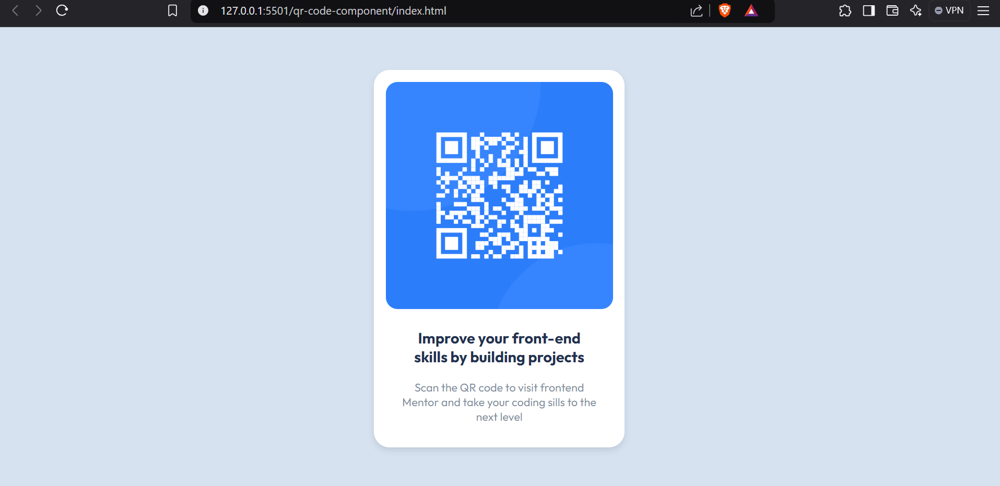

# Frontend Mentor - QR code component solution

This is my solution to the [QR code component challenge on Frontend Mentor](https://prathameshk11.github.io/FM-Qr-Code-Component/). 

## Table of contents
- [Overview](#overview)
  - [Screenshot](#screenshot)
  - [Links](#links)
- [My process](#my-process)
  - [Built with](#built-with)
  - [What I learned](#what-i-learned)
  - [Continued development](#continued-development)
  - [Useful resources](#useful-resources)
- [Author](#author)

## Overview

### Screenshot



### Links
- Solution URL: [GitHub Repository](https://github.com/Prathameshk11/FM-Qr-Code-Component)
- Live Site URL: [Live Demo](https://prathameshk11.github.io/FM-Qr-Code-Component/)

## My process

### Built with
- Semantic HTML5 markup
- CSS custom properties
- Flexbox
- Mobile-first workflow

### What I learned
- I learned how to properly align elements using **Flexbox** and apply styling with a **mobile-first approach**.
- Example snippet:
```css
.card {
  display: flex;
  flex-direction: column;
  align-items: center;
}
